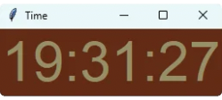

# Relógio Digital com Tkinter


Este projeto é um relógio digital simples, desenvolvido em Python utilizando a biblioteca Tkinter para a interface gráfica. Ele exibe o horário atual em tempo real, com uma interface personalizável e de fácil execução.

## Demonstração



> **Nota:** Imagem ilustrativa. Para ver o funcionamento, execute o script conforme instruções abaixo.

---

## Índice
- [Funcionalidades](#funcionalidades)
- [Pré-requisitos](#pré-requisitos)
- [Instalação e Execução](#instalação-e-execução)
- [Como funciona](#como-funciona)
- [Personalização](#personalização)
- [Estrutura do Projeto](#estrutura-do-projeto)
- [Licença](#licença)

---

## Funcionalidades
- Exibe o horário atual (horas, minutos e segundos) em tempo real
- Interface gráfica com cores personalizadas
- Atualização automática a cada segundo
- Código simples e fácil de entender

## Pré-requisitos
- Python 3.x instalado
  - [Download Python](https://www.python.org/downloads/)

## Instalação e Execução
1. **Clone ou baixe este repositório:**
   - Via terminal:
     ```bash
     git clone <url-do-repositorio>
     ```
   - Ou baixe o arquivo ZIP e extraia.
2. **Acesse a pasta do projeto:**
   ```bash
   cd tkinter_clock/relogio
   ```
3. **Execute o script:**
   ```bash
   python script.py
   ```

---

## Como funciona
O script utiliza a biblioteca Tkinter para criar uma janela gráfica e o módulo `time` para obter o horário do sistema. A função `update_clock` atualiza o texto do relógio a cada segundo, garantindo que o horário exibido esteja sempre correto.

```python
import tkinter as tk
import time

def update_clock():
    hora = time.strftime("%H")
    minuto = time.strftime("%M")
    segundo = time.strftime("%S")
    ceas.config(text=f"{hora}:{minuto}:{segundo}")
    ceas.after(1000, update_clock)

app = tk.Tk()
app.title("Time")
ceas = tk.Label(app, text="", font=("Helvetica", 48), fg='#978F66', bg="#622B14")
ceas.pack()
update_clock()
app.mainloop()
```

---

## Personalização
Você pode modificar facilmente as cores, fontes e o formato do horário alterando os parâmetros do widget `Label` e da função `strftime`.

- **Cor do texto:** `fg='#978F66'`
- **Cor de fundo:** `bg="#622B14"`
- **Fonte:** `font=("Helvetica", 48)`
- **Formato do horário:** Modifique o parâmetro de `strftime` para exibir data, AM/PM, etc.

Exemplo para mostrar data e hora:
```python
hora = time.strftime("%d/%m/%Y %H:%M:%S")
```

---

## Estrutura do Projeto
- `script.py`: Código-fonte principal do relógio digital
- `LICENSE`: Licença do projeto
- `README.md`: Este arquivo de documentação

---

## Licença
Este projeto está licenciado sob os termos do arquivo [LICENSE](LICENSE).

---

## Contato
Dúvidas, sugestões ou melhorias? Sinta-se à vontade para abrir uma issue ou entrar em contato!
